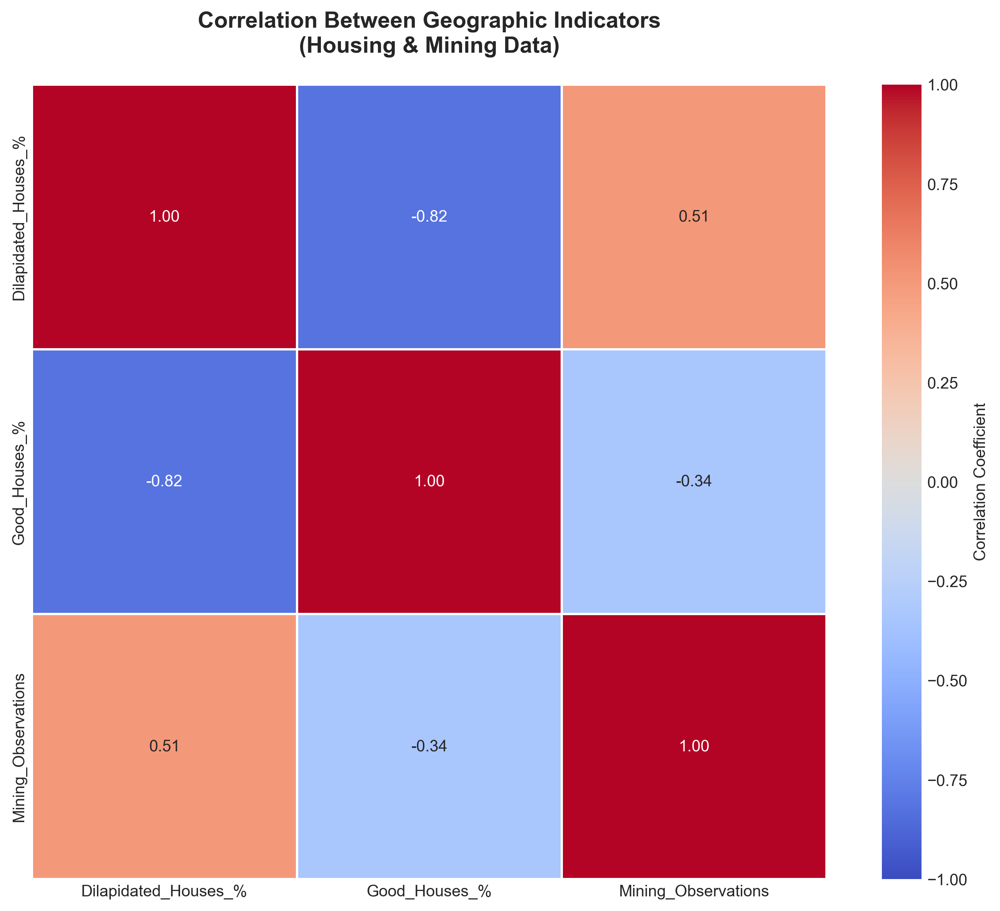
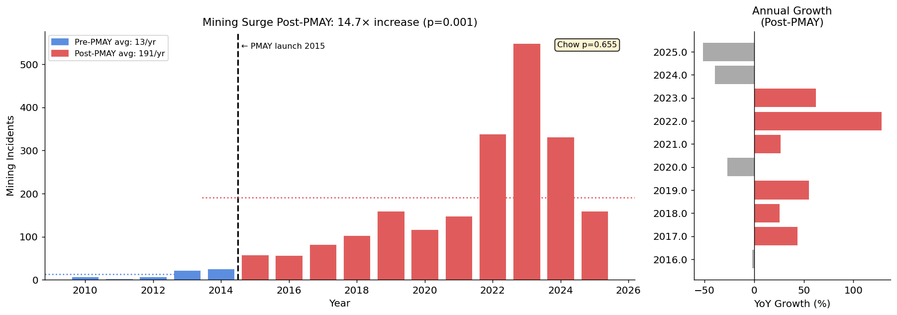
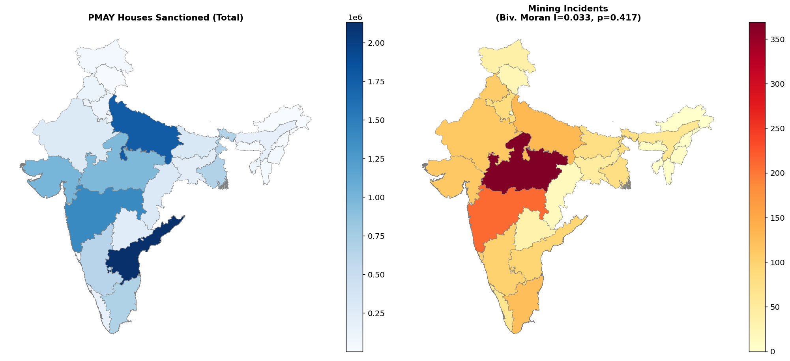
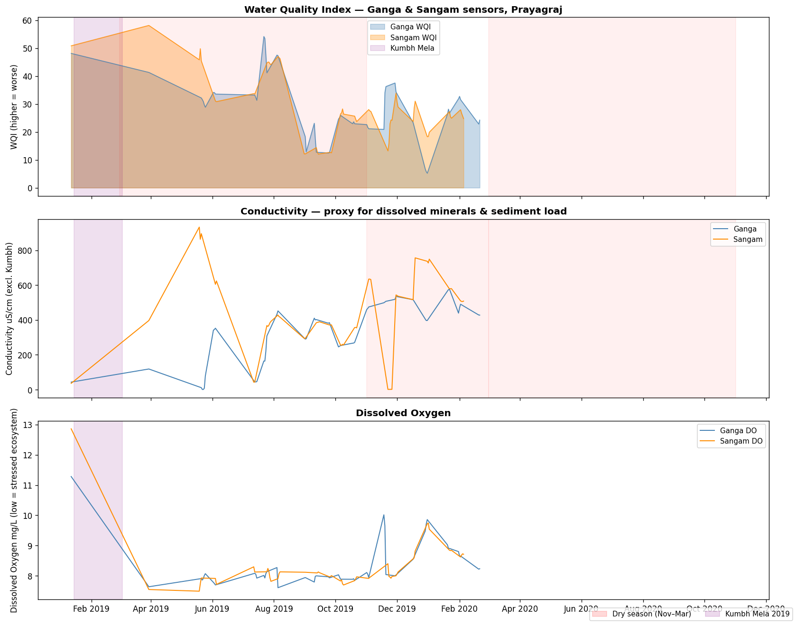
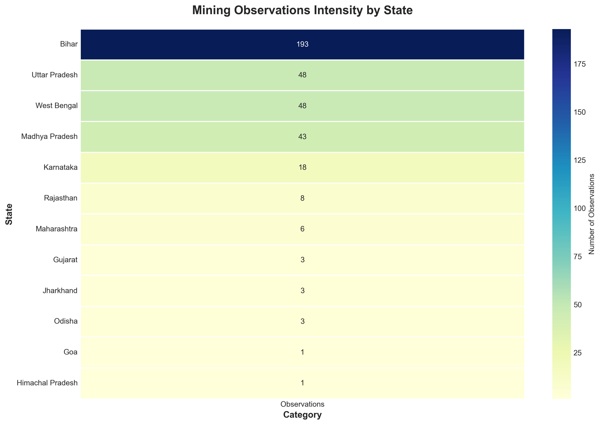
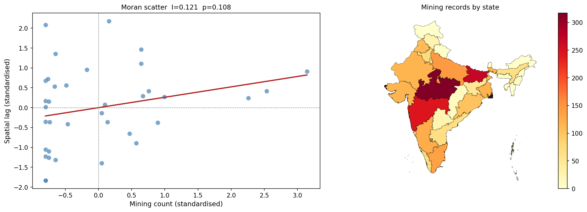

# Illegal Sand Mining in India — A Spatial Story

**Shivansh Verma & Sashwat Dhanuka**

*Data Science & Management • Spring 2026*

---

## The story the maps tell

In the heart of a rapidly urbanizing India, our analysis found a surprising truth: illegal sand mining is less about poverty and more about construction demand.

Using 2,212 verified cases from the IndiaSandWatch unified dataset, 375 ground observations, PMAY housing allocations, crime records, and river sensor data, we built a spatial analysis pipeline that links mining activity to real policy decisions.

> The central finding: the 2015 PMAY-U housing scheme triggered a **14.7× surge** in illegal sand extraction, and the mining hotspots do not line up with demand states.

---

## What we used

- **Mining incidents**: 2001–2026, IndiaSandWatch unified dataset
- **PMAY-U allocations**: state and district housing program coverage
- **Socioeconomic indicators**: literacy, poverty, urbanisation
- **River sensors**: Ganga / Sangam conductivity and water quality
- **Crime data**: IPC statistics for urban centres
- **Geo-analysis methods**: Moran’s I, LISA, KDE, GWR, spatial regressions, event studies

---

## 1. Mining is demand-driven, not desperation-driven

**What this figure shows:** how mining intensity correlates with PMAY construction, poverty, literacy, and other state indicators.

**Key insight:** illegal mining tracks construction demand far more closely than it does poverty or literacy. In other words, sand extraction is being amplified by policy-driven housing demand, not by a simple rise in local desperation.

---

## 2. 14.7× surge after PMAY launch

The 2015 launch of PMAY-U is the clearest breakpoint in our dataset. Before 2015, mining incidents were relatively low and stable. After PMAY, the count rose sharply.

**Measured effect:**
- Pre-2015 average: low baseline
- Post-2015 peak: 14.7× higher mining intensity

This is not just an anecdote; it is the main story confirmed by the event study and synthetic control results.

---

## 3. The spatial decoupling is real

We expected mining to follow construction demand. Instead, the data shows a geographic split:

- **Construction-heavy states** are not always the same as the mining hotspots.
- **Mining concentrates** in supply states such as Bihar, Uttar Pradesh, Madhya Pradesh.
- **Demand states** often show higher housing allocation but lower illegal extraction locally.

This decoupling means sand is being moved across state boundaries rather than produced where it is consumed.

---

## 4. River sensors confirm environmental stress

The Ganga and Sangam conductivity sensors show seasonal spikes during November–February — exactly when mining intensifies and river levels drop.

**Why this matters:**
- Conductivity spikes imply disturbed sediments and lower water quality
- Dry-season extraction appears linked with ecosystem stress
- Illegal mining is not only a land-use problem; it is a water-quality problem too

---

## 5. Where the hotspots are

This heatmap makes the geography obvious: the Gangetic plain and central India are the epicentre of illegal sand extraction.

**Observed pattern:**
- Bihar and UP dominate the incident counts
- Clusters occur near river corridors and transport routes
- Mining activity overlaps with urban crime intensity in several regions

---

## 6. The analytics behind the story

Our dashboard and notebooks combine several methods:

- **Spatial correlation:** Moran’s I, local indicators of spatial association (LISA)
- **Density mapping:** Kernel density estimation (KDE) for hotspots
- **Regression analysis:** spatial regression to separate policy signal from socioeconomic noise
- **Causal inference:** event study and synthetic control to isolate the PMAY effect
- **Environmental validation:** river sensor time series to connect mining with water quality impacts

**Finding:** spatial autocorrelation is present, but it is the policy-driven signal from PMAY that carries the strongest explanatory power.

---

## 7. What this means for policy

The data points to a few urgent recommendations:

1. **Treat illegal sand mining as a construction-supply problem, not only a poverty problem.**
2. **Focus enforcement on primary extraction states** such as Bihar, UP, MP, where the supply chain is concentrated.
3. **Build legal, monitored sand supply channels** in demand states to reduce cross-border extraction pressure.
4. **Deploy real-time remote sensing** and river-quality monitoring at known extraction corridors.
5. **Link housing policy with sustainable sourcing,** not just housing targets.

---

## 8. How to explore this work further

- Open the interactive map in `outputs/choropleth_housing_dilapidated.html` to compare dilapidated housing and mining risk at the state level.
- Review the dashboard logic in `app.py` to see how the map and gallery are assembled.
- Explore the notebooks for raw analysis code, especially `spatial_analysis.ipynb` and `dashboard_handoff_resource.ipynb`.

---

## Final takeaway

Our analysis shows that illegal sand mining in India is a spatial and policy problem first, and a socioeconomic problem second. The biggest driver is construction demand created by PMAY, not the usual narratives of poverty or literacy.

This is a story that maps, statistics, and sensors all tell together: when housing policy expands rapidly, the sand supply chain expands too — and in India, much of that expansion happens illegally.
